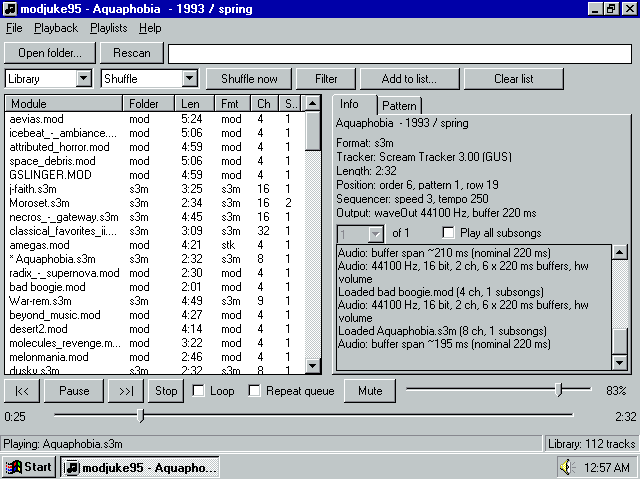

# modjuke95



A desktop tracker-music player built with **C++20**, **Win32** and
[**libopenmpt**](https://lib.openmpt.org/libopenmpt/).

modjuke95 is a port of [modjuke](https://github.com/FlamingLeo/modjuke)
for Windows 95, 98 and Me.

## Features

- Folder scanning, search, and filters for format, duration, and playable files.
- Automatic background analysis of library modules for lengths, formats, channel counts, subsong counts, and titles.
- Playlists with automatic saving and M3U-style persistence.
- Favorites and ignore lists.
- A live tracker view with centered playback following and channel paging.
- Song information, tracker/format metadata, and sequencer state.
- Track looping, queue repeat, shuffle orders, and subsong selection.
- Configurable output sample rate, interpolation, buffering, and tracker display delay.

## Requirements

- Windows 95, 98 or Me (minimum: 486).
- A working waveOut audio device.
- Module files.

## Editions

modjuke95 comes in two editions that differ only in which module formats
they play:

| Edition | Plays | Size |
| ---- | ---- | ---- |
| Full | All ~70 file types libopenmpt supports | ~2.4 MB |
| Common formats | MOD (and its variants), S3M, XM, IT, MPTM, STM, MTM, 669, MED, OKT, plus UMX/XPK/PP20/MMCMP-packed modules | ~1.8 MB |

*Help > About* shows the edition and the file types it plays. You can also see it in the logs at startup.

## Installation

Copy `modjuke95.exe` anywhere you like and run it. There is no installer. Everything the program writes goes into the folder that holds the executable.

### Locations

All files live next to `modjuke95.exe`:

| File | Contents |
| ---- | -------- |
| `modjuke95.ini` | Settings, playback/filter/view options, last song and position, playlist names |
| `last.m3u` | The library |
| `favorites.m3u` | Favorites |
| `playlist-N.m3u` | One file per playlist |
| `ignored.txt` | Ignored tracks |
| `shuffles.txt` | Saved shuffle orders |
| `analysis.cache` | Cached module analysis (length, format, title, ...) |
| `modjuke95-stage.log` | Startup progress markers |
| `modjuke95-crash.log` | Written only if the program crashes |
| `modjuke95-perf.log` | Only with `[perf] note=1` in the ini |

## Getting started

1. Start modjuke95 and press **Open folder...** to scan a directory of modules.
2. Double-click a track, or select it and press **Play**.
3. Use the source drop-down to switch between the library, a playlist, or favorites; the order drop-down chooses sorting or shuffle.

### Queue source and order

The list shows the currently selected *source*, which is either the scanned library, one of your playlists, or the favorites. The order drop-down sorts
alphabetically, by path, or draws a fresh shuffle order.

### Automatic analysis

Tracks are analyzed in the background when first scanned by length,
format, channels, subsongs, and the in-module title. Results are cached
in `analysis.cache`. Tracks that cannot be loaded are marked broken and can be filtered out.

### Playlists

Create, rename and delete playlists in the *Playlists* menu. *File > Import M3U* and *Export M3U* exchange lists with other players.

### Favorites

Right-click tracks (or use the *Playlists* menu) to add them to or
remove them from favorites, or to ignore them. Ignored tracks are hidden
everywhere and never played. *Playlists > Manage ignored tracks*
unignores them. Ignoring a track also removes it from favorites.

### Tracker and song information

The right panel has two pages: **Info** shows title, format, tracker
type, length, position, sequencer state and the log. **Pattern** is the
live tracker view.
Toggle with **F4** or *Playback > Tracker view*.

### Subsongs

Files containing several subsongs play the first one by default. Tick
**Play all subsongs** to play every subsong of a file in order before
moving on. The subsong drop-down above the list jumps directly to any
subsong of the selected track.

## Settings and audio

*Help > Settings*:

- **Sample rate**: output rate requested from waveOut.
- **Interpolation**: default, none, linear, cubic, or windowed sinc.
- **Buffering**: buffer size and count, trading latency against robustness on slow machines.
- **Tracker delay**: shifts the tracker display back by a fixed amount to match your sound card's (or VM's) output latency.
- **Window title**: show the internal module title or the filename in the window caption.
- **UI refresh**: one common refresh period for the info tab and the tracker view (smooth 50 ms to relaxed 500 ms).

Rate and buffering apply on the next track load. Everything else applies immediately.

## Keyboard and mouse controls

| Key / action | Effect |
| ---- | ---- |
| Double-click track, Enter | Play it / play the selection |
| Click / drag the seek bar | Jump to that position |
| Click / drag the volume bar | Set the volume |
| Space | Play / pause |
| Page Up / Page Down | Previous / next track |
| Left / Right | Seek 5 s (with Ctrl: 30 s) |
| L / R / M | Toggle loop / repeat queue / mute |
| + / - / 0 | Volume up / down / zero |
| F4 | Toggle tracker view page |
| Ctrl+Shift+Left / Right | Page tracker channels |
| F5 | Rescan |
| Ctrl+O | Open files |
| Ctrl+S | Shuffle now |
| Ctrl+F / Esc | Focus search / clear search |
| Tab / Enter (in the search box) | Back to the list |
| Ctrl+R | Reveal the playing song in the list |
| F1 | About |

## Troubleshooting

- **No sound**: Check the log lines at the bottom of the Info page. If
  waveOut cannot open any format, another application may own the audio
  device.
- **Dropouts on slow machines**: Change mixer settings. *Sample rate* 22050 saves about 40%, *Interpolation* Linear about 15% and None about 30%. Cubic is no cheaper than the default. A higher *Buffering* preset rides out short stalls. If
  the log on the Info page says `Audio: playback ran dry`, the program fell
  behind and more buffering helps. A dropout without that line happened
  after the program handed the audio on to e.g. the sound driver, a VM's emulated
  sound card, or Wine, and buffering here won't change it.
- **Tracker looks ahead of the sound**: Set *Tracker delay* to match
  your output latency. The log also prints an
  `Audio: buffer span ...` line after a few seconds of playback.
- **A song seems to end early**: It likely contains several subsongs;
  enable *Play all subsongs*.

## Building

modjuke95 is cross-compiled from a Linux x86_64 host. Host requirements: `curl`, `tar`, `xz`, `python3`, `make`.

```sh
./rebuild.sh                # llvm-mingw toolchain (~80 MB download, ~620 MB on disk)
./rebuild-rt.sh             # SSE-free CRT/C++ runtime + CRT headers into lib-rt/
                            # (~5 min on 4 cores)
./rebuild.sh --libopenmpt   # lib/libopenmpt.a + lib/libopenmpt-common.a +
                            # include/ (~2 min)
sh build.sh                 # build/modjuke95.exe (full edition) and
                            # build-common/modjuke95.exe (common formats) + audits
```

The first three steps run once, in this order (libopenmpt compiles
against the runtime's headers). Afterwards `sh build.sh` is all a rebuild
needs; `sh build.sh full` or `sh build.sh common` builds one edition.

| Path | Contents |
| ---- | -------- |
| `src/` | Application sources and the resource script |
| `resources/` | Program icon |
| `scripts/` | Build audits: `check95.py` (imports + PE header, uses `pe_imports.py`; also checks every CRTDLL import against `crtdll95.txt`, the export list of the Windows 95 `CRTDLL.DLL` made with `pe_exports.py`), `ssescan.sh` (SSE scan of objects/archives); `formats.py` (the common-formats edition's format set) |
| `build.sh` | Compiles and links both editions, then runs the Win95 import and SSE audits |
| `rebuild.sh` | Fetches the llvm-mingw toolchain, `--libopenmpt` builds libopenmpt 0.8.9 for Win95, full and common formats |
| `rebuild-rt.sh` | Rebuilds the static runtime (mingw-w64 v14 CRT for `CRTDLL.DLL`, libc++, libc++abi, libunwind, compiler-rt) for i486 without SSE |
| `LICENSE`, `THIRD-PARTY.txt`, `licenses/` | modjuke95's license (MIT), and the third-party code compiled into the exe with its license texts |

## License

modjuke95 is released under the [MIT License](LICENSE). The exe also contains libopenmpt (BSD 3-Clause, with stb_vorbis, minimp3 and miniz), the MinGW-w64 runtime and LLVM's runtime libraries; see [THIRD-PARTY.txt](THIRD-PARTY.txt) and the texts in `licenses/`.
